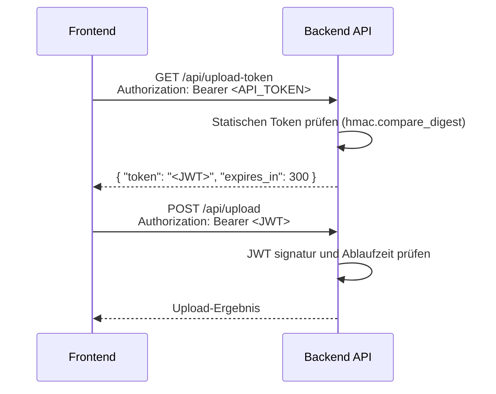
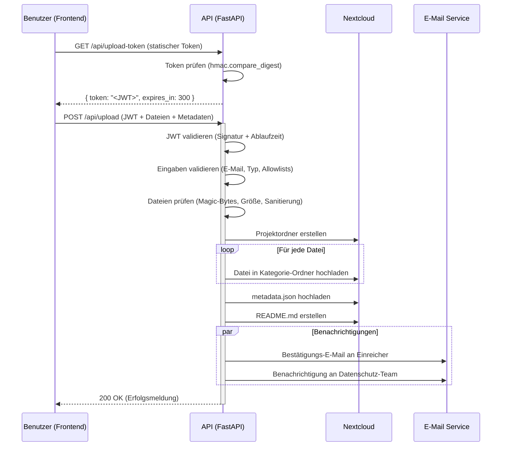

# API Dokumentation

Das Backend basiert auf FastAPI und stellt Endpunkte für Dokumenten-Uploads, Token-Austausch, Projektmanagement und System-Health-Checks bereit.

## Authentifizierung

Die API verwendet einen **zweistufigen Token-Exchange-Flow**, um zu verhindern, dass ein langlebiger statischer Token im Frontend-Bundle exponiert wird.

### Token-Exchange-Flow



**Schritt 1 – Upload-Token anfordern:**
Das Frontend sendet den statischen `API_TOKEN` (aus dem Build eingebettet via `VITE_API_TOKEN`) an `GET /api/upload-token`. Das Backend antwortet mit einem kurz-lebigen JWT (Standard: 5 Minuten).

**Schritt 2 – Upload durchführen:**
Das Frontend nutzt den erhaltenen JWT als Bearer-Token für `POST /api/upload`.

Der statische Token wird damit nie direkt für sensible Operationen verwendet – er dient nur zum Austausch gegen ein zeitlich begrenztes Credential.

## Request Correlation (X-Request-ID)

Für strukturiertes Logging und bessere Nachverfolgbarkeit unterstützt die API einen Correlation-Header:

- **Request**: `X-Request-ID: <uuid>`
- **Response**: Die API spiegelt `X-Request-ID` zurück (oder generiert eine neue, wenn keine mitgesendet wurde).

Diese ID erscheint in Backend-Logs als `request_id`.

## Rate Limiting

Endpunkte mit Rate-Limiting (pro IP-Adresse):

| Endpunkt | Limit |
|---------|-------|
| `POST /api/upload` | 10 Anfragen / Stunde |
| `GET /api/upload-token` | 30 Anfragen / Stunde |

Bei Überschreitung antwortet die API mit `429 Too Many Requests`.

## Endpunkte

### Auth

#### `GET /api/upload-token`

Tauscht den statischen API-Token gegen einen kurz-lebigen Upload-JWT.

**Authentifizierung:** Erforderlich (statischer `API_TOKEN`)

**Header:**
```
Authorization: Bearer <API_TOKEN>
```

**Rate Limit:** 30 Anfragen/Stunde pro IP

**Antwort:**

```json
{
  "token": "<JWT-String>",
  "expires_in": 300
}
```

| Feld | Typ | Beschreibung |
|------|-----|-------------|
| `token` | string | Kurz-lebiger JWT für Upload-Anfragen |
| `expires_in` | integer | Gültigkeitsdauer in Sekunden (Standard: 300) |

**Fehler:**

| Code | Beschreibung |
|------|-------------|
| `401 Unauthorized` | Ungültiger oder fehlender API-Token |
| `429 Too Many Requests` | Rate-Limit überschritten |

---

### Upload

#### `POST /api/upload`

Lädt Datenschutzdokumente in die Nextcloud hoch und löst Benachrichtigungen aus.

**Authentifizierung:** Erforderlich (Upload-JWT aus `/api/upload-token`)

**Header:**
```
Authorization: Bearer <JWT>
```

**Rate Limit:** 10 Anfragen/Stunde pro IP

**Parameter (Multipart/Form-Data):**

| Name | Typ | Beschreibung | Pflichtfeld |
|------|-----|-------------|:--------:|
| `email` | string (EmailStr) | E-Mail-Adresse des Einreichers | Ja |
| `uploader_name` | string | Name des Einreichers | Nein |
| `project_title` | string | Titel des Projekts | Ja |
| `institution` | string | `"university"` oder `"clinic"` | Ja |
| `is_prospective_study` | boolean | Prospektive Studie? | Nein |
| `project_details` | string | Zusätzliche Details | Nein |
| `files` | list[file] | Liste der hochzuladenden Dateien | Ja |
| `file_categories` | string | JSON-String: Dateiname → Kategorie | Nein |
| `project_type` | string | `"new"` oder `"existing"` | Nein (Standard: `"new"`) |
| `language` | string | `"de"` oder `"en"` | Nein (Standard: `"de"`) |

**Validierung:**
- `email` wird via Pydantic `EmailStr` geprüft
- `institution`, `project_type` und `language` werden gegen Allowlists validiert
- Dateinamen werden sanitiert (Path-Traversal-Schutz)
- Dateiinhalte werden via Magic-Bytes geprüft (nicht nur Dateiendung)
- Dateigröße wird gegen `MAX_FILE_SIZE` geprüft

**Antwort:**

```json
{
  "success": true,
  "project_id": "Projekt_Titel_2026-01-15",
  "timestamp": "2026-01-15T10:00:00.000000",
  "files_uploaded": 3,
  "message": "Documents uploaded successfully"
}
```

**Fehler:**

| Code | Beschreibung |
|------|-------------|
| `401 Unauthorized` | Ungültiger oder abgelaufener JWT |
| `413 Request Entity Too Large` | Datei überschreitet `MAX_FILE_SIZE` |
| `415 Unsupported Media Type` | Dateityp nicht erlaubt |
| `422 Unprocessable Entity` | Validierungsfehler (E-Mail, Felder) |
| `429 Too Many Requests` | Rate-Limit überschritten |

#### `GET /api/upload/status/{project_id}`

Ruft den Upload-Status und Metadaten für ein bestimmtes Projekt ab.

**Authentifizierung:** Erforderlich (Upload-JWT)

**Parameter:**

| Name | Typ | Beschreibung | Pflichtfeld |
|------|-----|-------------|:--------:|
| `project_id` | string | Die ID des Projekts | Ja |

**Antwort:** Metadaten-Objekt des Projekts (aus Nextcloud)

---

### Projekte

#### `GET /api/`

Listet alle Projekte auf.

**Hinweis:** Dieser Endpunkt gibt aktuell eine leere Liste zurück und dient als Platzhalter für eine zukünftige Implementierung.

**Authentifizierung:** Nicht erforderlich

**Antwort:**
```json
[]
```

---

### Health

#### `GET /api/health`

Health-Check-Endpunkt (für Deployment-Monitoring).

**Authentifizierung:** Nicht erforderlich

**Antwort:**
```json
{
  "status": "ok"
}
```

---

## Upload Workflow


