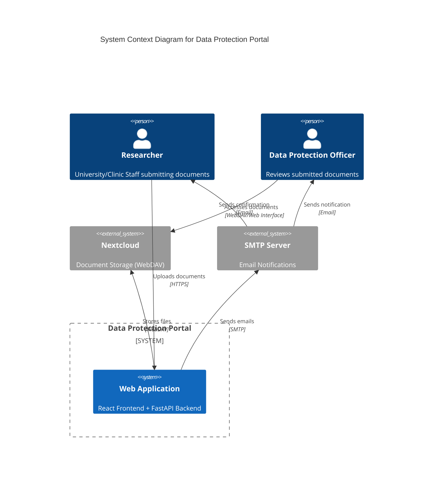

# Datenschutzportal

Das Datenschutzportal ist eine webbasierte Anwendung zur sicheren Einreichung und Verwaltung von datenschutzrelevanten Dokumenten für Forschungsprojekte der Universität Frankfurt und des Universitätsklinikums Frankfurt (UKF).

## System Überblick

## Features

- **Intuitiver Workflow**: Schritt-für-Schritt-Prozess zur Projekteinreichung (Institution → Projekttyp → Upload → Bestätigung).
- **Sicherer Upload**: Dateien werden direkt in eine gesicherte Nextcloud-Instanz hochgeladen.
- **Validierung**: Automatische Prüfung auf Vollständigkeit, Dateiformate und Dateiinhalt (Magic-Bytes).
- **Benachrichtigungen**: Automatische E-Mail-Bestätigungen für Einreicher und das Datenschutz-Team.
- **Mehrsprachigkeit**: Vollständige Unterstützung für Deutsch und Englisch (230+ Übersetzungsschlüssel).
- **Sicherheit (OWASP-konform)**: Rate Limiting, JWT-Token-Exchange, HTTP-Sicherheits-Header, Timing-sicherer Token-Vergleich, PII-Redaktion in Logs.
- **Strukturiertes Logging**: JSON-Logs mit Request-Korrelation via `X-Request-ID`.
- **Docker-Deployment**: Produktionsreif mit Traefik-Reverse-Proxy und automatischem TLS (Let's Encrypt).

## Quick Links

- [Backend Setup](backend/setup.md)
- [API Dokumentation](backend/api.md)
- [Frontend Architektur](frontend/architecture.md)
- [Deployment Guide](deployment/index.md)
- [Sicherheitsdokumentation](security.md)
- [Tech Stack](deployment/tech_stack.md)
