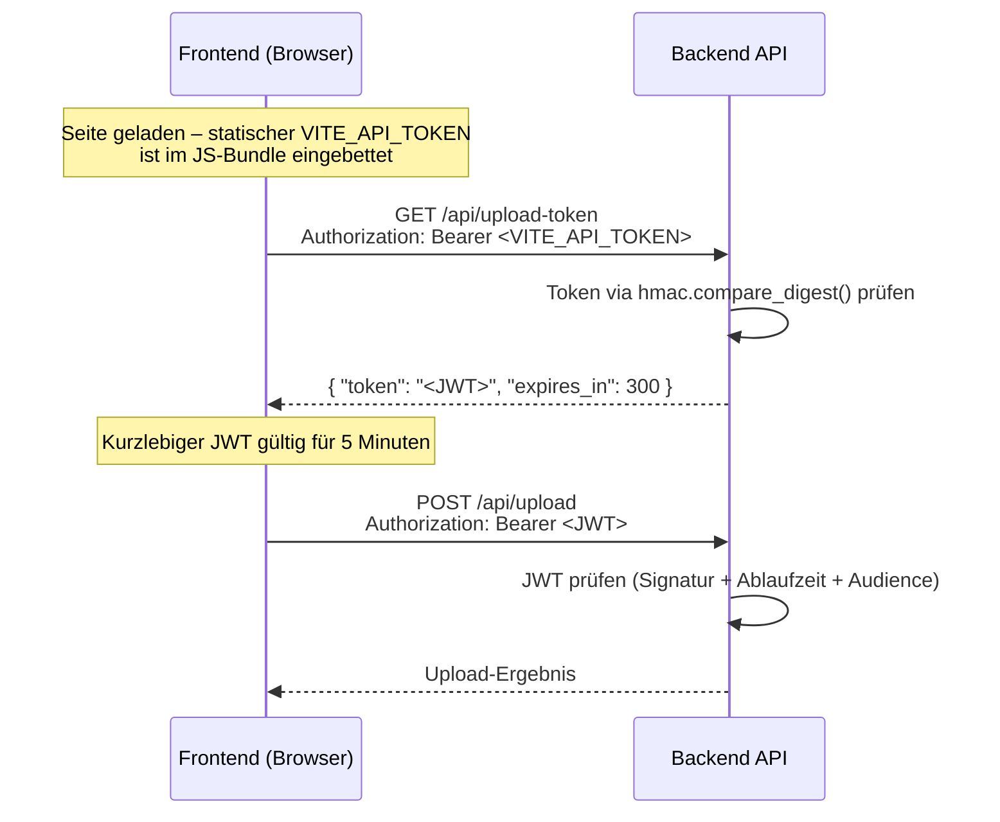

# Sicherheitsdokumentation

Das Datenschutzportal wurde nach den OWASP Top 10 (2021) entwickelt und einem vollständigen Sicherheitsaudit (März 2026) unterzogen. Diese Seite beschreibt die implementierten Sicherheitsmechanismen.

> Vollständiger Audit-Report mit allen Schwachstellen und Korrekturen: `SECURITY.md` im Projekt-Root.

## Token-Exchange-Flow (Authentifizierung)

Um zu verhindern, dass ein langlebiger statischer Token im öffentlich zugänglichen Frontend-Bundle exponiert wird, verwendet die API einen zweistufigen Authentifizierungsflow:



**Warum dieser Ansatz?**
Der statische Token (`API_TOKEN`) ist im Frontend-Bundle sichtbar für jeden Nutzer, der den Quellcode inspiziert. Er dient ausschließlich zum Austausch gegen ein kurz-lebiges JWT. Das JWT hat eine konfigurierbare Gültigkeitsdauer (Standard: 5 Minuten) und verliert danach automatisch seine Gültigkeit.

## HTTP-Sicherheits-Header

Alle API-Antworten enthalten folgende Security-Header (gesetzt durch `SecurityHeadersMiddleware`):

| Header | Wert | Zweck |
|--------|------|-------|
| `X-Content-Type-Options` | `nosniff` | Verhindert MIME-Sniffing |
| `X-Frame-Options` | `DENY` | Verhindert Clickjacking |
| `X-XSS-Protection` | `1; mode=block` | Aktiviert Browser-XSS-Filter |
| `Referrer-Policy` | `strict-origin-when-cross-origin` | Kontrolliert Referrer-Informationen |
| `Cache-Control` | `no-store` | Verhindert Caching sensibler Antworten |
| `Content-Security-Policy` | `default-src 'none'; frame-ancestors 'none'` | Verhindert Einbettung und Ressourcenladung |

## Rate Limiting

Rate Limiting (via `slowapi`, keyed by Client-IP) schützt vor Brute-Force-Angriffen und Ressourcenerschöpfung:

| Endpunkt | Limit | OWASP |
|---------|-------|-------|
| `POST /api/upload` | 10 Anfragen/Stunde | A04 – Insecure Design |
| `GET /api/upload-token` | 30 Anfragen/Stunde | A04 – Insecure Design |

Bei Überschreitung: `429 Too Many Requests`

## Datei-Upload-Sicherheit

### Magic-Bytes-Validierung

Datei-Uploads werden nicht nur anhand der Dateiendung geprüft, sondern auch durch Analyse des tatsächlichen Dateiinhalts (Magic Bytes) via `filetype`-Bibliothek. Damit werden Uploads verhindert, bei denen eine ausführbare Datei mit einer erlaubten Endung umbenannt wurde.

### Filename-Sanitierung

Dateinamen werden vor der Speicherung bereinigt:
1. `os.path.basename()` entfernt Pfadkomponenten (Path-Traversal-Schutz, CWE-22)
2. Sonderzeichen werden ersetzt
3. Dateiname-Länge wird begrenzt

### Dateitypb-Allowlist

Nur explizit erlaubte Dateiendungen werden akzeptiert (konfigurierbar via `ALLOWED_FILE_TYPES`):

```
.pdf, .doc, .docx, .odt, .ods, .odp, .zip, .png, .jpg, .jpeg, .xlsx, .csv, .odf
```

### Dateigrößen-Limit

Dateien werden gegen `MAX_FILE_SIZE` (Standard: 50 MB) geprüft.

## Eingabevalidierung

| Feld | Validierung |
|------|------------|
| `email` | Pydantic `EmailStr` (RFC 5322) |
| `institution` | Allowlist: `university`, `clinic` |
| `project_type` | Allowlist: `new`, `existing` |
| `language` | Allowlist: `de`, `en` |
| Dateinamen | Sanitierung (Path-Traversal-Schutz) |
| HTML in E-Mails | `html.escape()` für alle Nutzereingaben |

## Timing-sicherer Token-Vergleich

Token-Vergleiche nutzen `hmac.compare_digest()` (Python-Standardbibliothek) statt einfachem `==`/`!=`. Dies verhindert Timing-Angriffe (CWE-208), bei denen ein Angreifer durch Zeitmessung vieler Anfragen den gültigen Token Zeichen für Zeichen ableiten könnte.

## PII-Redaktion in Logs

E-Mail-Adressen und andere personenbezogene Daten (PII) werden nie im Klartext geloggt. Stattdessen wird ein HMAC-Hash mit `LOG_REDACTION_SECRET` verwendet. Damit sind Logs auswertbar (gleiche E-Mail → gleicher Hash), ohne dass PII rekonstruiert werden kann.

## CORS-Konfiguration

CORS ist auf das Minimum beschränkt:
- Erlaubte Methoden: `GET`, `POST` (keine PUT/DELETE/PATCH)
- Erlaubte Header: `Authorization`, `Content-Type`, `X-Request-ID`
- `allow_credentials=False` (keine Cookies)
- Erlaubte Ursprünge: konfigurierbar via `CORS_ORIGINS`

## OWASP Top 10 – Compliance-Übersicht

| OWASP | Kategorie | Status | Maßnahme |
|-------|-----------|--------|---------|
| A01 | Broken Access Control | Behoben | Path-Traversal-Sanitierung, Filename-Allowlist |
| A02 | Cryptographic Failures | Behoben | TLS via Traefik, kein PII in Logs, sicheres JWT |
| A03 | Injection | Behoben | `html.escape()` in E-Mails, Pydantic-Validierung |
| A04 | Insecure Design | Behoben | Rate Limiting, Token-Exchange-Flow |
| A05 | Security Misconfiguration | Behoben | Security-Header-Middleware, kein Default-Token |
| A06 | Vulnerable Components | Behoben | `python-jose` entfernt, alle Deps aktualisiert |
| A07 | Auth Failures | Behoben | `hmac.compare_digest()`, JWT Literal-Algorithmus |
| A08 | Software/Data Integrity | Behoben | Magic-Bytes-Validierung (`filetype`) |
| A09 | Logging Failures | Behoben | Strukturiertes Logging, PII-Redaktion |
| A10 | SSRF | N/A | Keine ausgehenden Requests auf Nutzereingaben |

## Abhängigkeitssicherheit

Entfernte Pakete aufgrund bekannter CVEs:

| Paket | CVE | Ersatz |
|-------|-----|--------|
| `python-jose` | PYSEC-2024-232 (DoS), PYSEC-2024-233 (Algorithm Confusion) | `PyJWT>=2.8.0` |

Aktualisierte Pakete mit Sicherheits-Fixes:

| Paket | Behobene CVEs |
|-------|--------------|
| `fastapi>=0.115.0` | Mehrere |
| `python-multipart>=0.0.22` | CVE-2026-24486, CVE-2024-53981 |
| `jinja2>=3.1.6` | CVE-2024-22195, CVE-2024-34064, CVE-2024-56326, CVE-2024-56201, CVE-2025-27516 |
| `vite`, `rollup` (Frontend) | Mehrere |
